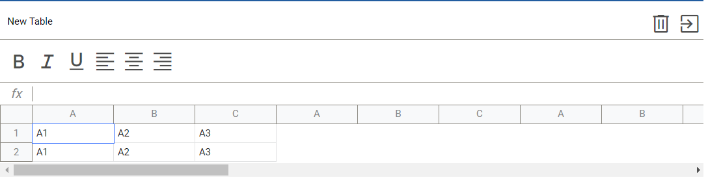

# HELLO WORLD! :earth_africa:
**********
**Excel in Vanilla JavaScript**:green_book:

Main stack of these application: *Vanilla JavaScript(ES6+), SCSS, WebPack, Babel, Html*:stuck_out_tongue:

It's my *vision* in realization popular spreadsheet Excel.

**What I've done**:question:
**********
**User guide**
1. Download zip-archive with code and open it in *VSCode/WebStorm*.
2. In console write next command to install all dependencies and modules for our project.
`npm install`
3. Then in console write next command to start program in live server.
`npm run start`
These command will configure our webpack and start the project.
**********
**How does it look like**

**********
I just relax and gained experience here.

Still in progress? Convert to draft!:wink:

>When the night was full of terrors. When you had not touched me yet. Oh, take me back to the night we met.:microphone:Lord Huron — The Night We Met

